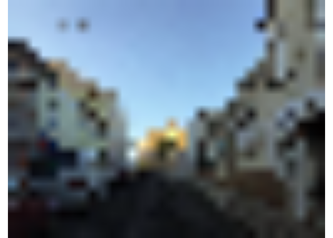
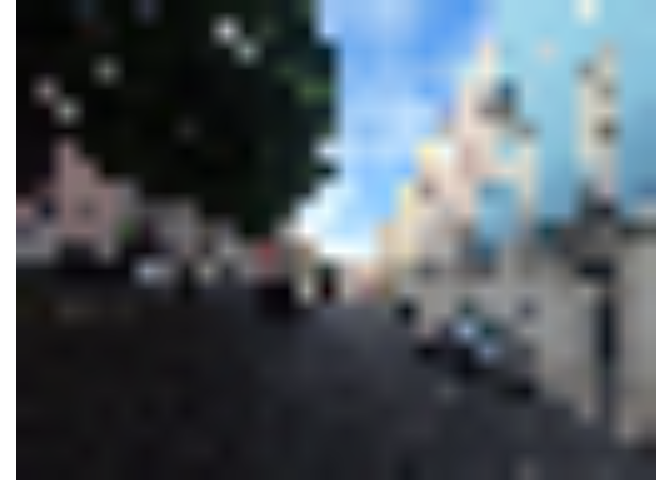
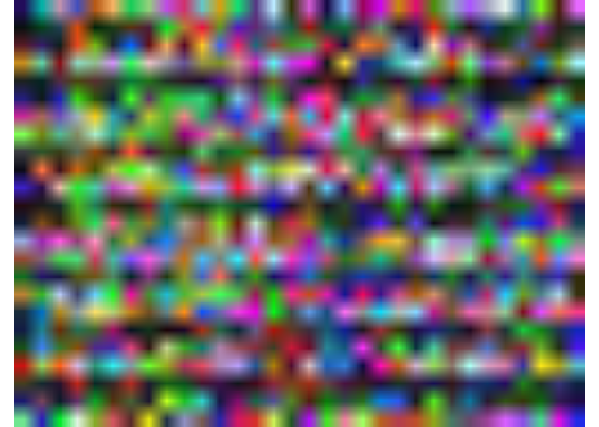
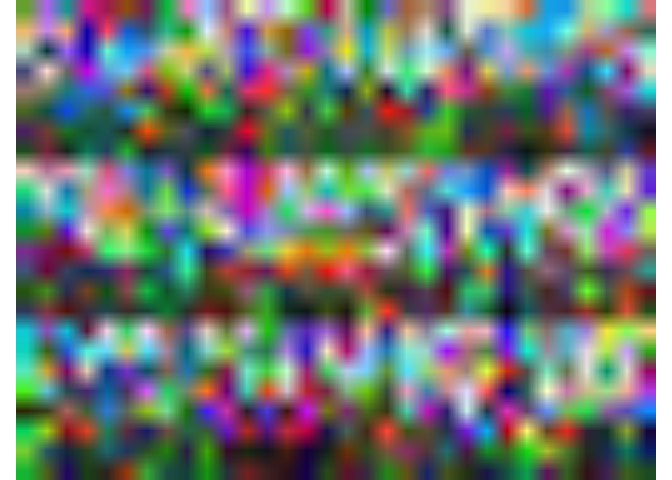

Conditional Variational Autoencoder
================

##### 1. Import libraries

``` r
# With TF-2, you can still run this code due to the following line:
if (tensorflow::tf$executing_eagerly())
  tensorflow::tf$compat$v1$disable_eager_execution()

library(keras)
K <- keras::backend()

#library(keras)
library(tidyverse)
library(imager)
library(recolorize)
library(OpenImageR)
library(readxl)
```

##### 2. Import dataset

###### Download the dataset and create data set folder

``` r
Train_filtered_files = "https://github.com/valenca13/CVAE_StreetDesign/releases/download/1.0/Train_Images_filtered.zip"
Train_filtered = download.file(Train_filtered_files, destfile = "Dataset/files.zip")
unzip(zipfile = "Dataset/files.zip", exdir = "Dataset/Images")

Test_filtered_files = "https://github.com/valenca13/CVAE_StreetDesign/releases/download/1.0/Test_Images_filtered.zip"
Test_filtered = download.file(Test_filtered_files, destfile = "Dataset/files2.zip")
unzip(zipfile = "Dataset/files2.zip", exdir = "Dataset/Images")

labels_train_files = "https://github.com/valenca13/CVAE_StreetDesign/releases/download/1.0/Features_Dummy_Train.zip"
labels_train = download.file(labels_train_files, destfile = "Dataset/files3.zip")
unzip(zipfile = "Dataset/files3.zip", exdir = "Dataset/Features")

labels_test_files = "https://github.com/valenca13/CVAE_StreetDesign/releases/download/1.0/Features_Dummy_Test.zip"
labels_test = download.file(labels_test_files, destfile = "Dataset/files4.zip")
unzip(zipfile = "Dataset/files4.zip", exdir = "Dataset/Features")
```

###### List files in folder

``` r
files_train <- list.files("Dataset/Images/Train_filtered",  full.names = TRUE, pattern = ".jpg", all.files = TRUE)
#files_train_labels <- list.files("Dataset/Features/Features_Class_Train/",  full.names = TRUE, pattern = ".txt", all.files = TRUE)
labels_train <- read_excel('Dataset/Features/Features_Dummy_Train/Labels_Dummy.xlsx')

files_test <- list.files("Dataset/Images/Test_filtered",  full.names = TRUE, pattern = ".jpg", all.files = TRUE)
#files_test_labels <- list.files("Dataset/Features/Features_Class_Test/",  full.names = TRUE, pattern = ".txt", all.files = TRUE)
labels_test <- read_excel('Dataset/Features/Features_Dummy_Test/Labels_Dummy_test.xlsx')
```

##### 3.Data preprocessing

**a) Training data**

-   **IMAGES**

###### Resize images and assign to a list

``` r
Results_train <- list()
for(i in seq_along(files_train)){
  Image <- readImage(files_train[i]) 
  Resized <- resizeImage(Image, width = 24, height = 32) #uniform size of images
  Results_train[[i]] <- Resized
}
```

> **Note**: The size of the images were substatially reduced for it to
> able to run and appear in Github.

###### Check the number of dimensions

``` r
dim(Results_train[[2]])
```

    ## [1] 24 32  3

###### Show an example of an image from the training dataset

``` r
imageShow(Results_train[[300]])
```

<!-- -->

###### Convert list of images into arrays

``` r
train_array <- array(unlist(Results_train), dim=c(1265,24,32,3))
dim(train_array)
```

    ## [1] 1265   24   32    3

-   **FEATURES**

###### Convert features into a Dummy (with or without an object). Filter only the feature: with or without pedestrians.

``` r
labels_train$X.person. <- as.integer(labels_train$X.person.)
y_t <- data.frame(labels_train[-c(1:3)]) %>% 
  as.matrix()
y_train <- to_categorical(y_t, num_classes = NULL, dtype="float32") 
```

**b) Test data**

-   **IMAGES**

###### Resize images and assign to a list

``` r
Results_test <- list()
for(i in seq_along(files_test)){
  Image <- readImage(files_test[i])
  Resized <- resizeImage(Image, width = 24, height = 32)
  Results_test[[i]] <- Resized
}
```

###### Check the number of dimensions

``` r
dim(Results_test[[2]])
```

    ## [1] 24 32  3

###### Show an example of an image from the test dataset

``` r
imageShow(Results_test[[3]])
```

<!-- -->

###### Convert list of images into arrays

``` r
test_array <- array(unlist(Results_test), dim=c(243,24,32,3))
```

-   **FEATURES**

###### Convert features into a Dummy (with or without an object). Filter only the feature: with or without pedestrians.

``` r
labels_test$X.person. <- as.integer(labels_test$X.person.)
y_te <- data.frame(labels_test[-c(1:3)]) %>% 
  as.matrix() 
y_test <- to_categorical(y_te, num_classes = NULL, dtype = "float32") 
```

##### 4. Data preparation

``` r
library(listarrays)

x_train <- train_array %>% 
  `/` (255) 
```

> **Note**: keras.Conv2D layers expect input with 4D shape.

``` r
dim(x_train)
```

    ## [1] 1265   24   32    3

``` r
x_test <- test_array %>% 
  `/` (255) 
```

##### 5. CONDITIONAL VARIATIONAL AUTOENCODER

###### Input image dimensions

``` r
img_rows <- 24L
img_cols <- 32L
img_channels <- 3L # Greyscale = 1 and RGB = 3
```

**a) Training parameters**

``` r
batch_size <- 2L   # number of training samples used in one iteration

epochs <- 50L  # number of times that the learning algorithm will work through the entire training dataset

original_dim <- c(img_rows, img_cols, img_channels)

## Number of convolutional filters to use
filters <- 1L #Detects the patterns on the data.

# Convolution kernel size
num_conv <- 3L

#Dimensionality
intermediate_dim <- 128L
latent_dim <- 2L
epsilon_std <- 1.0

#Shape 
x_train_shape <- dim(x_train)[1]

y_train_shape <- dim(y_train)[2] 
```

**b) Model definition**

##### ENCODER

``` r
x <- layer_input(shape = original_dim, name = 'x')

conv_1 <- layer_conv_2d(
  x,
  filters = img_channels,
  kernel_size = c(2L, 2L),
  strides = c(1L, 1L),
  padding = "same",
  activation = "relu"
)

conv_2 <- layer_conv_2d(
  conv_1,
  filters = filters,
  kernel_size = c(2L, 2L),
  strides = c(2L, 2L),
  padding = "same",
  activation = "relu"
)

conv_3 <- layer_conv_2d(
  conv_2,
  filters = filters,
  kernel_size = c(num_conv, num_conv),
  strides = c(1L, 1L),
  padding = "same",
  activation = "relu"
)

conv_4 <- layer_conv_2d(
  conv_3,
  filters = filters,
  kernel_size = c(num_conv, num_conv),
  strides = c(1L, 1L),
  padding = "same",
  activation = "relu"
)
```

###### Flattern the layer to be in same dimension as the label

``` r
flat <- layer_flatten(conv_4, input_shape = x_train_shape)

#Label
label <- layer_input(shape = y_train_shape, name = 'label') 

inputs <- layer_concatenate(list(flat,label))
```

###### Define dense layers

``` r
h <- layer_dense(inputs, intermediate_dim, activation = "relu") #hidden layer
z_mean <- layer_dense(h, latent_dim, name = 'latent_mu')
z_log_var <- layer_dense(h, latent_dim, name = 'latent_sigma')
```

###### Reparameterization trick

``` r
sampling <- function(arg){
  z_mean <- arg[, 1:(latent_dim)]
  z_log_var <- arg[, (latent_dim + 1):(2 * latent_dim)]
  
  epsilon <- k_random_normal(
    shape = c(k_shape(z_mean)[[1]]), 
    mean=0.,
    stddev=epsilon_std
  )
  
  z_mean + k_exp(z_log_var/2)*epsilon
}
```

> **Note**: The reparameterization trick allows the model to train both
> **mu** and **sigma** of the latent space.

> **Note**: We define a sampling function to sample from the
> distribution. z = z_mean + sigma\*epsilon;  
> where, sigma = exp(log_var/2)

-   z_mean (mu) is a vector that represents the the mean point of the
    distribution;
-   log_var is a vector that represents the logarithm of the variance of
    each dimension;
-   epsilon is a point sampled from the standard normal distribution.

###### LATENT SPACE: Define “z” by creating a sample vector from the latent distribution

``` r
z <- layer_concatenate(list(z_mean, z_log_var)) %>%   
  layer_lambda(sampling)
```

###### Merge latent space with features

``` r
zc <- layer_concatenate(list(z, label))
```

###### Define and summarize the encoder model

``` r
encoder <- keras_model(c(x,label),c(z_mean,z_log_var)) #Images and labels
summary(encoder)
```

    ## Model: "model"
    ## ________________________________________________________________________________
    ##  Layer (type)             Output Shape      Param #  Connected to               
    ## ================================================================================
    ##  x (InputLayer)           [(None, 24, 32,   0        []                         
    ##                           3)]                                                   
    ##  conv2d (Conv2D)          (None, 24, 32, 3  39       ['x[0][0]']                
    ##                           )                                                     
    ##  conv2d_1 (Conv2D)        (None, 12, 16, 1  13       ['conv2d[0][0]']           
    ##                           )                                                     
    ##  conv2d_2 (Conv2D)        (None, 12, 16, 1  10       ['conv2d_1[0][0]']         
    ##                           )                                                     
    ##  conv2d_3 (Conv2D)        (None, 12, 16, 1  10       ['conv2d_2[0][0]']         
    ##                           )                                                     
    ##  flatten (Flatten)        (None, 192)       0        ['conv2d_3[0][0]']         
    ##  label (InputLayer)       [(None, 2)]       0        []                         
    ##  concatenate (Concatenate  (None, 194)      0        ['flatten[0][0]',          
    ##  )                                                    'label[0][0]']            
    ##  dense (Dense)            (None, 128)       24960    ['concatenate[0][0]']      
    ##  latent_mu (Dense)        (None, 2)         258      ['dense[0][0]']            
    ##  latent_sigma (Dense)     (None, 2)         258      ['dense[0][0]']            
    ## ================================================================================
    ## Total params: 25,548
    ## Trainable params: 25,548
    ## Non-trainable params: 0
    ## ________________________________________________________________________________

##### DECODER

``` r
output_shape <- c(batch_size, 12L, 16L, filters) # For the encoder to have the same dimensions as the decoder

decoder_input <- layer_input(shape = latent_dim+y_train_shape, name = 'decoder_input')
# We need to start with a shape that can be remapped to the original image shape.

decoder_upsample <- layer_dense(units = prod(output_shape[-1]), activation = "relu")
decoder_hidden <- layer_dense(units = intermediate_dim, activation = "relu")

decoder_reshape <- layer_reshape(target_shape = output_shape[-1])   #output_shape[-1]

decoder_deconv_1 <- layer_conv_2d_transpose(
  filters = filters,
  kernel_size = c(num_conv, num_conv),
  strides = c(1L, 1L),
  padding = "same",
  activation = "relu"
)

decoder_deconv_2 <- layer_conv_2d_transpose(
  filters = filters,
  kernel_size = c(num_conv, num_conv),
  strides = c(1L, 1L),
  padding = "same",
  activation = "relu"
)

decoder_deconv_3_upsample <- layer_conv_2d_transpose(
  filters = img_channels,
  kernel_size = c(3L, 3L),
  strides = c(2L, 2L),
  padding = "same",
  activation = "softmax"
)


hidden_decoded <- decoder_hidden(z)
up_decoded <- decoder_upsample(hidden_decoded)
reshape_decoded <- decoder_reshape(up_decoded)
deconv_1_decoded <- decoder_deconv_1(reshape_decoded)
deconv_2_decoded <- decoder_deconv_2(deconv_1_decoded)
outputs <- decoder_deconv_3_upsample(deconv_2_decoded)
```

##### c) Define Loss function

``` r
vae_loss <- function(x, outputs) {
  x <- k_flatten(x)
  outputs <- k_flatten(outputs)
  xent_loss <- 1.0 * img_rows * img_cols * loss_binary_crossentropy(x, outputs)
  kl_loss <- -0.5 * k_mean(1 + z_log_var - k_square(z_mean) - k_exp(z_log_var), axis = -1L)
  k_mean(xent_loss + kl_loss)
}
```

###### CVAE model

``` r
cvae <- keras_model(c(x,label), outputs)
cvae %>% compile(optimizer = "adam", loss = vae_loss)

summary(cvae)
```

    ## Model: "model_1"
    ## ________________________________________________________________________________
    ##  Layer (type)             Output Shape      Param #  Connected to               
    ## ================================================================================
    ##  x (InputLayer)           [(None, 24, 32,   0        []                         
    ##                           3)]                                                   
    ##  conv2d (Conv2D)          (None, 24, 32, 3  39       ['x[0][0]']                
    ##                           )                                                     
    ##  conv2d_1 (Conv2D)        (None, 12, 16, 1  13       ['conv2d[0][0]']           
    ##                           )                                                     
    ##  conv2d_2 (Conv2D)        (None, 12, 16, 1  10       ['conv2d_1[0][0]']         
    ##                           )                                                     
    ##  conv2d_3 (Conv2D)        (None, 12, 16, 1  10       ['conv2d_2[0][0]']         
    ##                           )                                                     
    ##  flatten (Flatten)        (None, 192)       0        ['conv2d_3[0][0]']         
    ##  label (InputLayer)       [(None, 2)]       0        []                         
    ##  concatenate (Concatenate  (None, 194)      0        ['flatten[0][0]',          
    ##  )                                                    'label[0][0]']            
    ##  dense (Dense)            (None, 128)       24960    ['concatenate[0][0]']      
    ##  latent_mu (Dense)        (None, 2)         258      ['dense[0][0]']            
    ##  latent_sigma (Dense)     (None, 2)         258      ['dense[0][0]']            
    ##  concatenate_1 (Concatena  (None, 4)        0        ['latent_mu[0][0]',        
    ##  te)                                                  'latent_sigma[0][0]']     
    ##  lambda (Lambda)          (None, 2)         0        ['concatenate_1[0][0]']    
    ##  dense_2 (Dense)          (None, 128)       384      ['lambda[0][0]']           
    ##  dense_1 (Dense)          (None, 192)       24768    ['dense_2[0][0]']          
    ##  reshape (Reshape)        (None, 12, 16, 1  0        ['dense_1[0][0]']          
    ##                           )                                                     
    ##  conv2d_transpose (Conv2D  (None, 12, 16, 1  10      ['reshape[0][0]']          
    ##  Transpose)               )                                                     
    ##  conv2d_transpose_1 (Conv  (None, 12, 16, 1  10      ['conv2d_transpose[0][0]'] 
    ##  2DTranspose)             )                                                     
    ##  conv2d_transpose_2 (Conv  (None, 24, 32, 3  30      ['conv2d_transpose_1[0][0]'
    ##  2DTranspose)             )                          ]                          
    ## ================================================================================
    ## Total params: 50,750
    ## Trainable params: 50,750
    ## Non-trainable params: 0
    ## ________________________________________________________________________________

##### d) Model training

``` r
cvae_final <- fit(cvae,
  list(x_train,y_train), x_train,
  verbose = 1,
  epochs = epochs, 
  batch_size = batch_size, 
  validation_data = list(list(x_test,y_test), x_test)
)
```

##### e) Present examples of images generated by the generative model

###### Generated image from the the training database

``` r
imageShow(x_train[3,,,])
```

<!-- -->

###### Generated image from the the test database

``` r
imageShow(x_test[3,,,])
```

<!-- -->

> **Note**: In this example we are printing images with id=3 of the
> training and test datasets.
