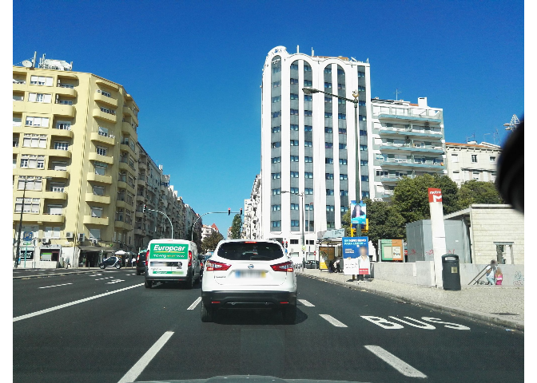
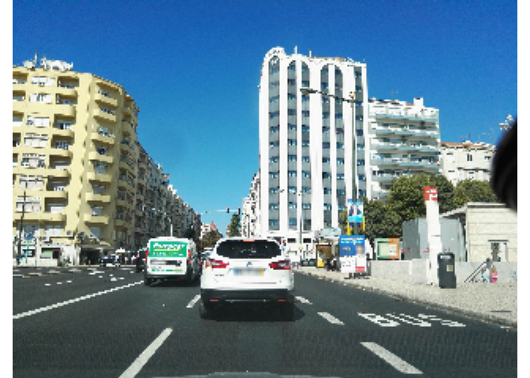
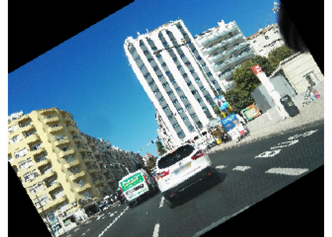
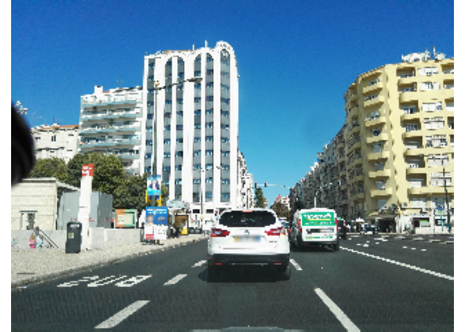
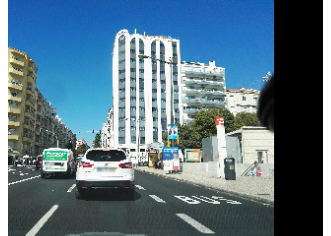
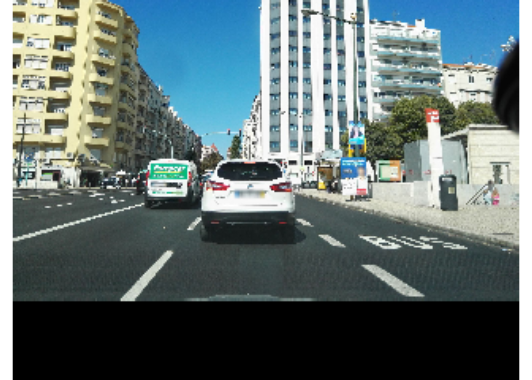

Image Augmentation
================

##### 1. Import libraries

``` r
library(tidyverse)
library(OpenImageR)
```

##### 2. Import training images

Import dataset of filtered images from training.

``` r
files_train <- list.files("Example_Image",  full.names = TRUE, pattern = ".jpg", all.files = TRUE)
```

-   Show an example of an image from the original dataset:

``` r
Results_train <- list()
for(i in seq_along(files_train)){
  Image <- readImage(files_train[i]) 
  Results_train[[i]] <- Image
}

imageShow(Results_train[[1]])
```

<!-- -->

##### 3. Resize images

``` r
Resize_train <- list()
for(i in seq_along(files_train)){
  Image <- readImage(files_train[i]) 
  Resized <- resizeImage(Image, width = 240, height = 320) #uniform size of images
  Resize_train[[i]] <- Resized
}
imageShow(Resize_train[[1]])
```

<!-- -->

##### 4. Image rotation

``` r
Rotation_train <- list()
for(i in seq_along(files_train)){
  Image <- readImage(files_train[i]) 
  Rotated <- resizeImage(Image, width = 240, height = 320) %>% 
    Augmentation(
      flip_mode = NULL,
      crop_width = NULL,
      crop_height = NULL,
      resiz_width = 0,
      resiz_height = 0,
      resiz_method = "nearest",
      shift_rows = 0,
      shift_cols = 0,
      rotate_angle = 30,
      rotate_method = "nearest",
      zca_comps = 0,
      zca_epsilon = 0,
      image_thresh = 0,
      padded_value = 0,
      verbose = FALSE
    ) 
  Rotation_train[[i]] <- Rotated
  #writeImage(Rotated, paste0("Train/Rotated_Images/", i, ".jpg"))    #Save image in folder
  #while (!is.null(dev.list()))  dev.off()
}

imageShow(Rotation_train[[1]])
```

<!-- -->

##### 5. Horizontal flip (Mirror)

``` r
flip_train <- list()
for(i in seq_along(files_train)){
  Image <- readImage(files_train[i]) 
  flip <- resizeImage(Image, width = 240, height = 320) %>% 
    Augmentation(
      flip_mode = "horizontal",    #a character string ('horizontal', 'vertical')
      crop_width = NULL,
      crop_height = NULL,
      resiz_width = 0,
      resiz_height = 0,
      resiz_method = "nearest",
      shift_rows = 0,
      shift_cols = 0,
      rotate_angle = 0,
      rotate_method = "nearest",
      zca_comps = 0,
      zca_epsilon = 0,
      image_thresh = 0,
      padded_value = 0,
      verbose = FALSE
    ) 
  flip_train[[i]] <- flip
  #writeImage(flip, paste0("Train/flip_Images/", i, ".jpg"))    #Save image in folder
  #while (!is.null(dev.list()))  dev.off()
}

imageShow(flip_train[[1]])
```

<!-- -->

##### 6. Width shifted (Shift columns)

``` r
w_shift_train <- list()
for(i in seq_along(files_train)){
  Image <- readImage(files_train[i]) 
  wshift <- resizeImage(Image, width = 240, height = 320) %>% 
    Augmentation(
      flip_mode = NULL,    #a character string ('horizontal', 'vertical')
      crop_width = NULL,
      crop_height = NULL,
      resiz_width = 0,
      resiz_height = 0,
      resiz_method = "nearest",
      shift_rows = 0,
      shift_cols = 50,
      rotate_angle = 0,
      rotate_method = "nearest",
      zca_comps = 0,
      zca_epsilon = 0,
      image_thresh = 0,
      padded_value = 0,
      verbose = FALSE
    ) 
  w_shift_train[[i]] <- wshift
  #writeImage(wshift, paste0("Train/wshift_Images/", i, ".jpg"))    #Save image in folder
  #while (!is.null(dev.list()))  dev.off()
}

imageShow(w_shift_train[[1]])
```

<!-- -->

##### 7. Height shift (Shift rows)

``` r
h_shift_train <- list()
for(i in seq_along(files_train)){
  Image <- readImage(files_train[i]) 
  hshift <- resizeImage(Image, width = 240, height = 320) %>% 
    Augmentation(
      flip_mode = NULL,    #a character string ('horizontal', 'vertical')
      crop_width = NULL,
      crop_height = NULL,
      resiz_width = 0,
      resiz_height = 0,
      resiz_method = "nearest",
      shift_rows = 50,
      shift_cols = 0,
      rotate_angle = 0,
      rotate_method = "nearest",
      zca_comps = 0,
      zca_epsilon = 0,
      image_thresh = 0,
      padded_value = 0,
      verbose = FALSE
    ) 
  h_shift_train[[i]] <- hshift
  #writeImage(hshift, paste0("Train/hshift_Images/", i, ".jpg"))      #Save image in folder
  #while (!is.null(dev.list()))  dev.off()
}

imageShow(h_shift_train[[1]])
```

<!-- -->

##### 8. ZCA Whitening

``` r
white_train <- list()
for(i in seq_along(files_train)){
  Image <- readImage(files_train[i]) 
  white <- resizeImage(Image, width = 240, height = 320) %>% 
    ZCAwhiten(30, 0.1) 
  white_train[[i]] <- white
  #writeImage(white, paste0("Train/hshift_Images/", i, ".jpg"))     #Save image in folder
  #while (!is.null(dev.list()))  dev.off()
}

imageShow(white_train[[1]])
```

<!-- -->

##### 9. Edge Detection

``` r
edgedet_train <- list()
for(i in seq_along(files_train)){
  Image <- readImage(files_train[i]) 
  edge <- resizeImage(Image, width = 240, height = 320) %>% 
    edge_detection(method = 'Prewitt', conv_mode = 'same')  #Methods: 'Frei_chen', 'LoG', 'Prewitt', 'Roberts_cross', 'Scharr', 'Sobel'
  edgedet_train[[i]] <- edge
  #writeImage(edge, paste0("Train/edge_Images/", i, ".jpg"))   #Save image in folder
  #while (!is.null(dev.list()))  dev.off()
}

imageShow(edgedet_train[[1]])
```

<!-- -->
